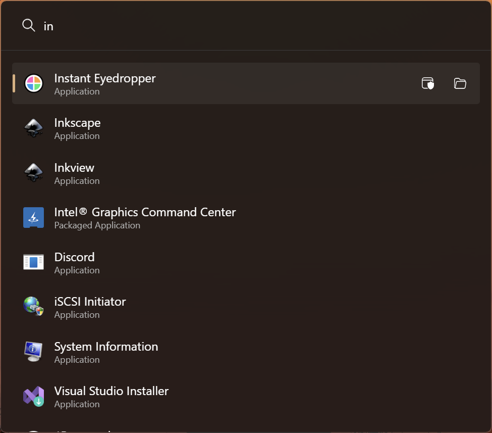
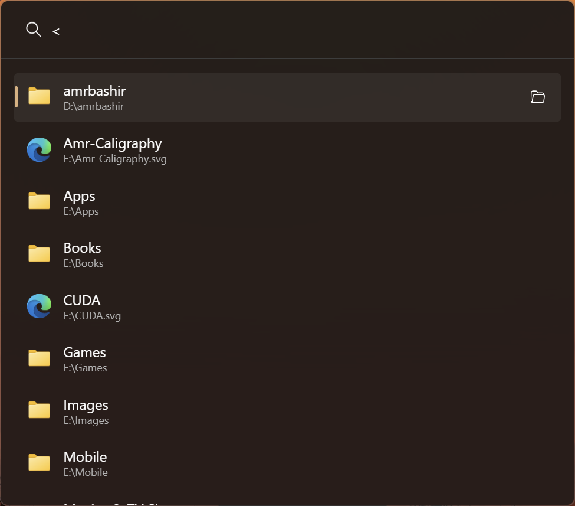
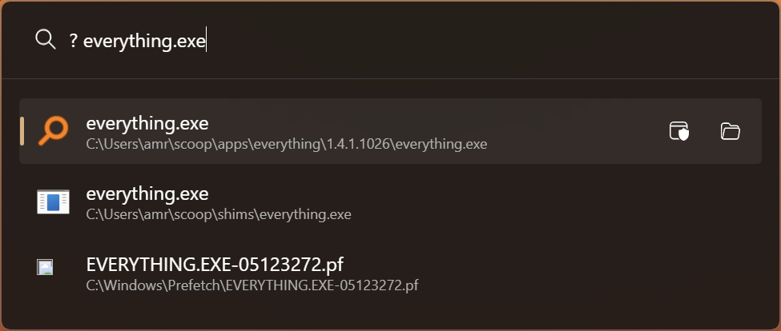
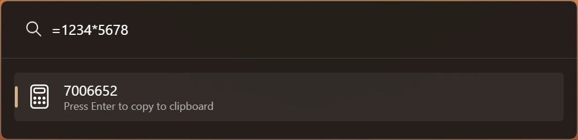
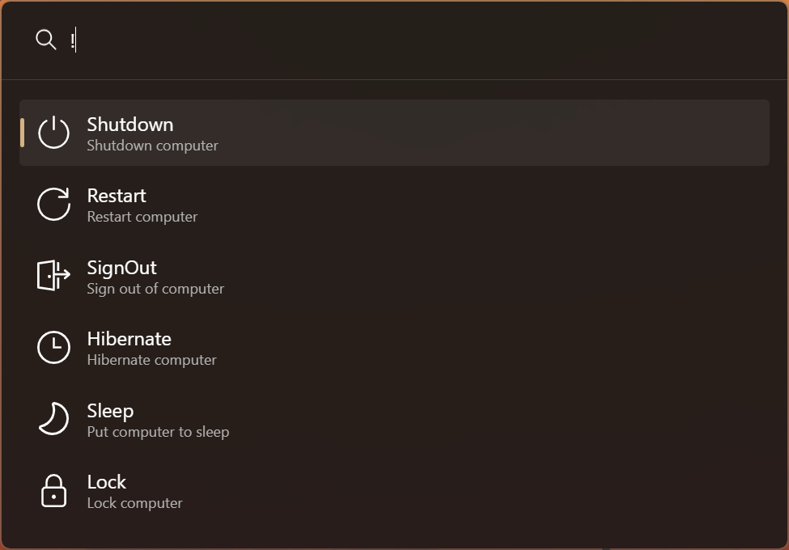
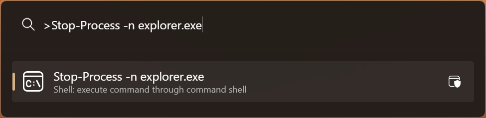
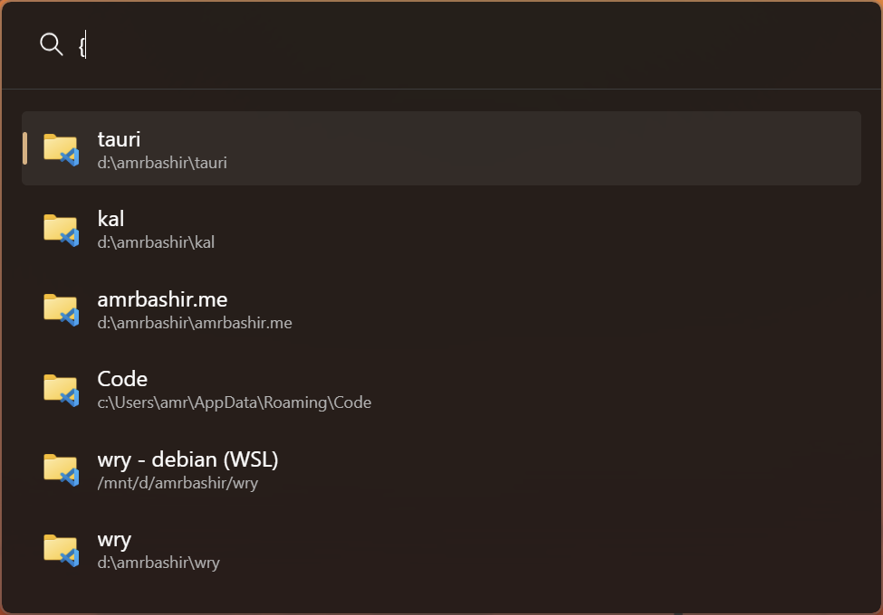
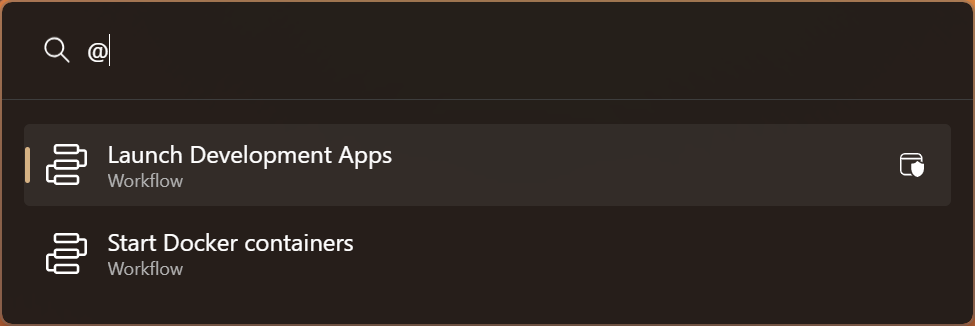

<p align="center"></p>

# kal

Keyboard-driven app launcher and productivity tool (only Windows for now).

> [!WARNING]
>
> kal is still in early development, use at your own risk.

<p align="center"></p>

## Why?

It is fun to build things so why not build my own.

While there is a lot of similar apps out there, they either
big in size
or not enough customizability
or missing a feature I need daily, for example [Workflows](#workflows)
and [simple directory indexer](#directoryindexer) to acess some common directories and files.

Also I want to write plugins in any programming langauge and not just C# and .NET or electron and Node.js.

## Install

Download the installer from the [latest](https://github.com/amrbashir/komorebi-switcher/releases/latest) release.

Or through PowerShell:

```powershell
irm "https://github.com/amrbashir/kal/releases/latest/download/kal-setup.exe" -OutFile "kal-setup.exe"
& "./kal-setup.exe"
```

## Usage

By default, you can open kal by using <kbd>Alt+Space</kbd>. This can be configured in [config](#config).

## Features

### <p align="center">App Launcher</p>

_<p align="center">Search and launch Applications</p>_

<p align="center"></p>

### <p align="center">DirectoryIndexer</p>

_<p align="center">Index a defined set of directories for quick access</p>_

<p align="center"></p>

### <p align="center">Everything Search</p>

_<p align="center">Search through the file system using [Everything](https://www.voidtools.com/)</p>_

<p align="center"></p>

### <p align="center">Calculator</p>

_<p align="center">Simple calcuolator for quick mathematical operations</p>_

<p align="center"></p>

### <p align="center">System Commands</p>

_<p align="center">A set of commands to control the OS</p>_

<p align="center"></p>

### <p align="center">Shell</p>

_<p align="center">Quickly execute commands in shell</p>_

<p align="center"></p>

### <p align="center">VSCode Workspaces</p>

_<p align="center">List and search through VSCode recently opened workspaces</p>_

<p align="center"></p>

### <p align="center">Workflows</p>

_<p align="center">Define a set of common workflows, like opening multiple applications together</p>_

<p align="center"></p>

## Config

Config by default is read from `$HOME/.config/kal.toml`.

## Future plans

- [ ] Settings UI
- [ ] Commands to control Kal itself
- [ ] Scoop.sh installer
- [ ] Winget installer
- [ ] Plugins in any programming language (C ABI compatible)
- [ ] Native-like hover tooltips
- [ ] Linux

## Development

### Prerequisites:

1. [Node.js](https://nodejs.org)
2. [Rust and Cargo](https://rustup.rs/)
3. [WebView2 Runtime](https://developer.microsoft.com/en-us/microsoft-edge/webview2/?form=MA13LH)

#### Scripts:

- `.scripts/dev.ps1` to start development.
- `.scripts/build.ps1` to build the app.
- `.scripts/create-installer.ps1` to create the installer.

## Thanks and Acknowledgement

This project is inspired by:

- [ueli](https://github.com/oliverschwendener/ueli)
- [wox](https://github.com/Wox-launcher/Wox)
- [PowerToys Run](https://docs.microsoft.com/en-us/windows/powertoys/run)

## LICENSE

[MIT](./LICENSE) License
