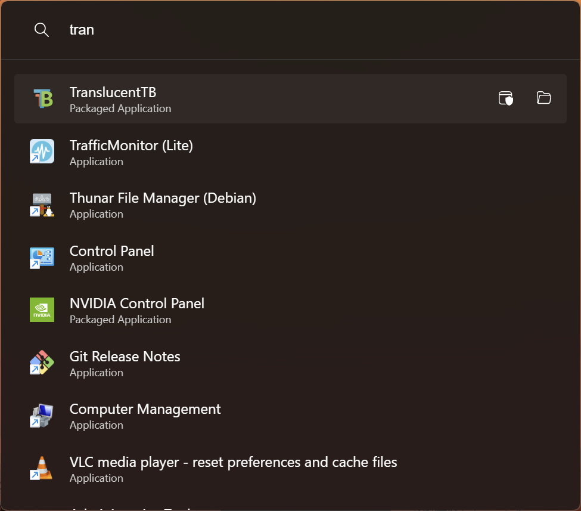

# kal

Keyboard-driven app launcher and productivity tool (only Windows for now).

## Why?

It is fun to build things so why not build my own.

While there is a lot of similar apps out there, they either
big in size
or not enough customizability
or missing a feature I need daily, for example [Workflows](#workflows)
and [simple directory indexer](#directoryindexer) to acess some common directories and files.

Also I want to write plugins in any programming langauge and not just C# and .NET or electron and Node.js.

## Features

### App Launcher

### DirectoryIndexer

### Everything Search

### Calculator

### System Commands

### Shell

### VSCode Workspaces

### Workflows

## Config

Config by default is read from `$HOME/.config/kal.toml`

## Future plans

- [ ] Settings UI
- [ ] Plugins in any programming language (C ABI compatible)
- [ ] Linux

## Development

### Prerequisites:

1. [Node.js](https://nodejs.org)
2. [Rust and Cargo](https://rustup.rs/)
3. [WebView2 Runtime](https://developer.microsoft.com/en-us/microsoft-edge/webview2/?form=MA13LH)

#### Scripts:

- `.scripts/dev.ps1` to start development.
- `.scripts/build.ps1` to build the app.

## Thanks and Acknowledgement

This project is inspired by:

- [ueli](https://github.com/oliverschwendener/ueli)
- [wox](https://github.com/Wox-launcher/Wox)
- [PowerToys Run](https://docs.microsoft.com/en-us/windows/powertoys/run)

## LICENSE

[MIT](./LICENSE) License
